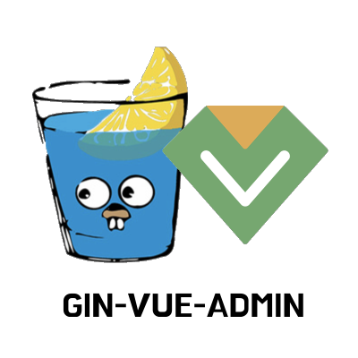

<div align="center">
  
</div>

# gin-vue-admin


> 企业级后台管理系统：**Gin** 后端 + [vue-admin/vue-admin](https://github.com/vue-admin/vue-admin) 前端，遵循业界标准（SOLID / KISS / Clean Architecture）实现。

后端自研，**严格对齐前端 MSW mock 契约**（端点路径、方法、字段一一对应）；前端基于 [vue-admin/vue-admin](https://github.com/vue-admin/vue-admin) 演进，已并入本仓库 `web/` 目录统一维护。

## 架构

```
┌─────────────┐   HTTP /api    ┌──────────────────────────────┐
│  web (Vue3) │ ──────────────▶│  server (Go/Gin)             │
│  Element Plus│  ◀─ ApiResult  │  handler→service→repository   │
│  Pinia      │   ◀─ ProblemDet │  →model (GORM/MySQL)          │
└─────────────┘                └──────────────────────────────┘
```

| 模块 | 技术栈 | 路径 | 说明 |
|------|--------|------|------|
| 前端 | Vue3 + Vite + TS + Element Plus + Pinia | `web/` | 基于 vue-admin 演进，已并入本仓库 |
| 后端 | Go + Gin + GORM + JWT + zap + viper | `server/` | 自研，三层架构 + 构造注入 |
| 部署 | Docker + docker-compose + Nginx | `deploy/` | 一键起全栈 |

### 后端分层（Clean Architecture）

```
handler (HTTP) → service (业务) → repository (接口) → model (GORM)
                    ↘ pkg: jwt / hash / pagination / csvutil / async / apperr
                    ↘ middleware: AuthRequired / RequirePermission (缓存 TTL)
```

依赖方向单向，repository 抽接口便于单测注入 mock。

## 功能模块

| 模块 | 状态 | 说明 |
|------|------|------|
| 认证 (M2) | ✅ | 登录/刷新/登出/me，JWT 双 token，防枚举，bcrypt |
| 权限 (M3.1) | ✅ | 权限码 CRUD + 通用分页/CSV + 权限中间件（超管 `*` 短路） |
| 角色 (M3.2) | ✅ | 角色 CRUD + 权限分配子资源（code↔id 严格校验） |
| 用户 (M3.3) | ✅ | 用户 CRUD + 多角色 + 防自删/自禁 + 批量删/导出 |
| 菜单 (M4.1) | ✅ | 动态路由菜单树（MenuDTO + meta.permissions） |
| 部署 (M5) | ✅ | 多阶段 Dockerfile + docker-compose + nginx 反代 |
| 数据层基座 (M6) | ✅ | 泛型 `GenericRepository[T]` + 审计字段（CreatedBy/UpdatedBy/DeletedBy）+ 新模块开发指南 |
| 组织基座 (M7) | ✅ | 部门（树形+级联删）+ 字典（三级 categories/dicts/items） |
| 日志与权限 (M8) | ✅ | 操作日志 + 登录日志 + 数据范围（按角色 DataScope）+ Swagger API 文档 |
| 开发体验 (M9) | ✅ | 代码生成器 `cmd/scaffold`（CLI 生成 model/repo/service/handler） |
| 系统配置 (M10) | ✅ | `sys_config` + 内存缓存 + CRUD + 编程 API（运营改配置不发版） |
| 工程化 | ✅ | MIT License · golangci-lint v2 · GitHub Actions CI · Swagger UI |

## 差异化能力（对标 RuoYi/go-admin/django-admin）

- **审计字段**：GORM 回调自动注入操作者；软删记录 DeletedBy
- **数据范围**：`pkg/datascope` 按角色 `DataScope`（all/dept/dept_and_sub/self）控制可见数据，超管短路
- **登录防枚举**：失败响应文案统一，真实原因仅写入登录日志
- **代码生成器**：`go run ./cmd/scaffold -name Post -fields title:string,views:int` 一键生成四层代码
- **Swagger 文档**：访问 `/swagger/index.html`，84 个端点全注解

## API 契约（核心约定）

- **成功**：`HTTP 200 + { code: 0, data, msg, traceId? }`
- **失败**：`HTTP 4xx/5xx + ProblemDetail`（RFC 7807，含 `type/title/status/detail/code/errors/traceId`）
- **鉴权**：请求头 `Authorization: Bearer <accessToken>`，JWT access/refresh 双 token（refresh 轮换）
- **权限**：RBAC 权限码模型（`*` 通配超管 + `user:list` 等具体码）
- **校验错误**：HTTP 422 + `VALIDATION_ERROR`

> 后端任何端点的路径/方法/字段必须与 `web/src/mock/handlers/*.ts` 保持一致。

## 快速开始

### 前置依赖

- Go 1.25+、Node 22+、pnpm 9+、Docker（部署用）
- MySQL 8（本地开发）或直接用 Docker（见部署）

### 一、Docker 全栈部署（推荐）

```bash
git clone <repo>
cd gin-vue-admin
cp deploy/.env.example deploy/.env   # 按需改密码/端口
make compose-build                    # 构建并启动 mysql + server + web
```

访问 `http://localhost`，受限网络在 `.env` 设 `REGISTRY=docker.m.daocloud.io/library`。

### 二、本地开发

```bash
# 1. 起 MySQL（Docker）
docker run -d --name gva-mysql -p 13306:3306 \
  -e MYSQL_ROOT_PASSWORD=root -e MYSQL_DATABASE=gva mysql:8

# 2. 后端
cd server && cp configs/config.example.yaml configs/config.yaml   # 首次：从模板创建本地配置（config.yaml 被 gitignore）
cd .. && make server-dev  # :8080（端口冲突见下方"端口冲突处理"）
curl http://localhost:8080/api/health

# 3. 前端
make web-install         # 首次安装依赖
make web-dev             # http://localhost:5173（端口冲突见下方"端口冲突处理"）
```

> 后端配置支持环境变量覆盖（`GVA_` 前缀，双下划线分隔嵌套）：
> `GVA_DB__HOST`、`GVA_DB__PORT`、`GVA_JWT__SECRET`、`GVA_SERVER__PORT` 等。

### 端口冲突处理

框架默认使用 Gin 标准 8080、vite 标准 5173。若本机端口被占用，用环境变量覆盖（无需改代码/配置）：

| 服务 | 环境变量 | 示例 |
|------|----------|------|
| 后端监听端口 | `GVA_SERVER__PORT` | `GVA_SERVER__PORT=8088 make server-dev` |
| 前端 dev 端口 | `VITE_PORT` | `VITE_PORT=5174 make web-dev` |
| 前端连后端地址 | `GVA_API_TARGET` | 后端非 8080 时，前端需同步：`GVA_API_TARGET=http://localhost:8088 make web-dev` |

> vite 默认 `strictPort:false`，5173 被占会自动递增到下一个可用端口；如需固定端口，命令行加 `--strictPort`。

## 测试账号（启动自动 seed）

| 用户名 | 密码 | 角色 | 权限 |
|--------|------|------|------|
| admin | 123456 | super_admin | 全部（`*`） |
| user | 123456 | user | `user:read` |

> 生产环境务必修改默认密码与 JWT secret。

## 开发命令

```bash
make server-lint        # golangci-lint 静态检查（CI 门禁）
make server-test        # 后端单测
make server-cover       # 单测 + 生成覆盖率报告（cover.html）
make server-swag        # 重新生成 Swagger docs 包（改 handler 注解后）
make server-build       # 编译二进制到 server/bin
make server-tidy        # 整理依赖
make server-ci          # CI 本地复现：lint → swagger → vet → test → build
make compose-up/down    # 启停全栈
```

## 项目结构

```
gin-vue-admin/
├── server/                    # Go 后端
│   ├── cmd/api/main.go        # 入口（依赖组装）
│   ├── internal/
│   │   ├── handler/           # HTTP 端点
│   │   ├── service/           # 业务逻辑（含 *_test.go）
│   │   ├── repository/        # 数据访问（接口 + gorm 实现）
│   │   ├── model/             # GORM 实体
│   │   ├── middleware/        # AuthRequired / RequirePermission
│   │   ├── pkg/               # apperr/response/jwt/hash/pagination/csvutil/async/log
│   │   └── server/            # 路由装配
│   └── configs/config.yaml    # 配置（环境变量可覆盖）
├── web/                       # Vue3 前端（基于 vue-admin 演进）
├── deploy/                    # Dockerfile / docker-compose / nginx
└── docs/superpowers/          # 设计 spec 与实现计划
```

## 测试

分层测试策略，SQLite 临时库隔离，无外部依赖即可跑：

| 层 | 覆盖范围 |
|----|----------|
| repository / service | 真实 SQLite + GORM，覆盖 CRUD/过滤/数据范围 |
| handler | `httptest` 端到端，打通鉴权→业务→持久化（auth 登录链路 + user CRUD） |
| pkg | `datascope`/`csvutil` 100%，`pagination` 87%，`audit` 69% |

```bash
make server-test         # 全量
make server-cover        # 覆盖率报告
```

> handler 集成测试模式已建立（auth/user），其余模块按 CONTRIBUTING 渐进补齐。

## 贡献与安全

- 贡献流程、代码规范、提交规范见 [CONTRIBUTING.md](CONTRIBUTING.md)
- 安全漏洞报告流程见 [SECURITY.md](SECURITY.md)（**勿用公开 issue 报告安全问题**）
- 变更历史见 [CHANGELOG.md](CHANGELOG.md)

欢迎提 issue / PR。新功能请先开 issue 讨论，避免重复劳动或方向偏离。

## License

[MIT](LICENSE) © gin-vue-admin contributors
